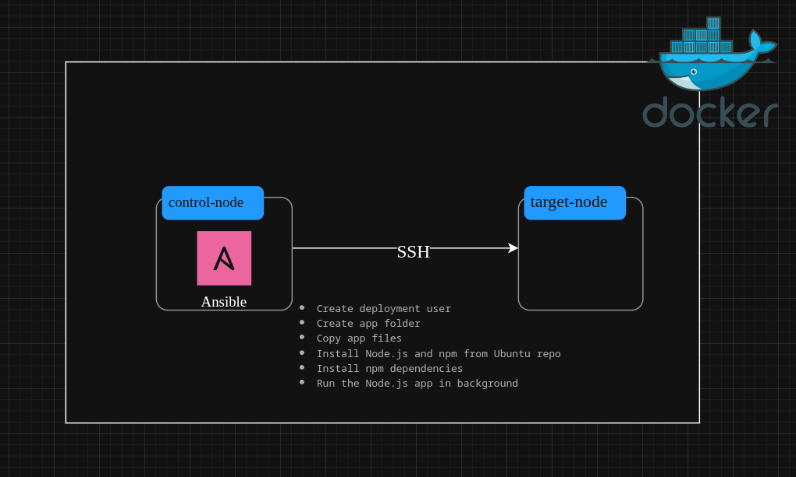

The project contains two main folders:

- **app/** — holds the Node.js application source code (e.g., `index.js`, `package.json`).

- **ansible/** — contains the Ansible playbook (`playbook.yml`) and inventory file (`inventory.ini`).

Inside the Ansible playbook:

- The playbook connects to the target node defined in `inventory.ini`.

- It creates a deployment user (`webadmin`) and necessary directories (`/opt/app`).

- Installs Node.js on the target machine.

- Copies the application files to `/opt/app`.

- Runs `npm install` to install dependencies as `webadmin` user.

- Starts the Node.js application in the background.

Docker is used to simulate the control and target nodes as separate containers, enabling testing of the Ansible automation without real servers.
